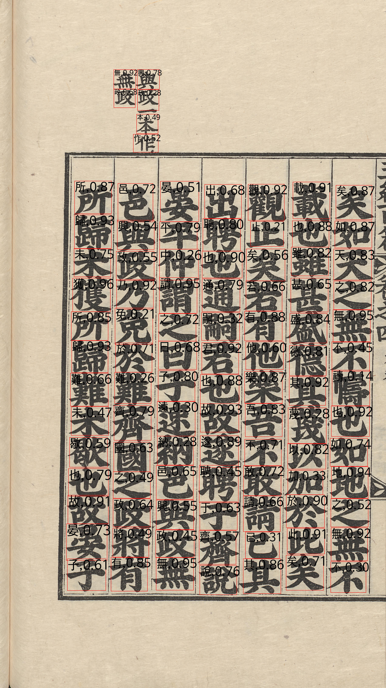
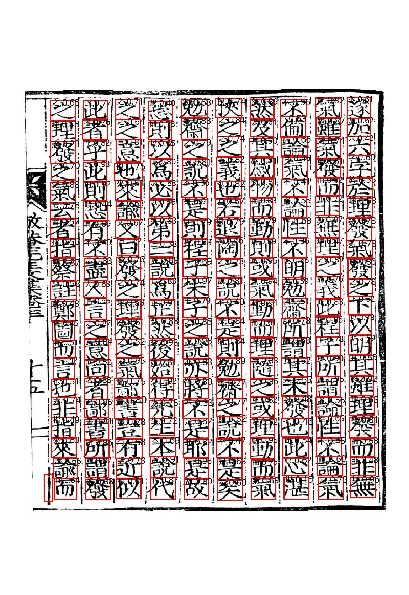
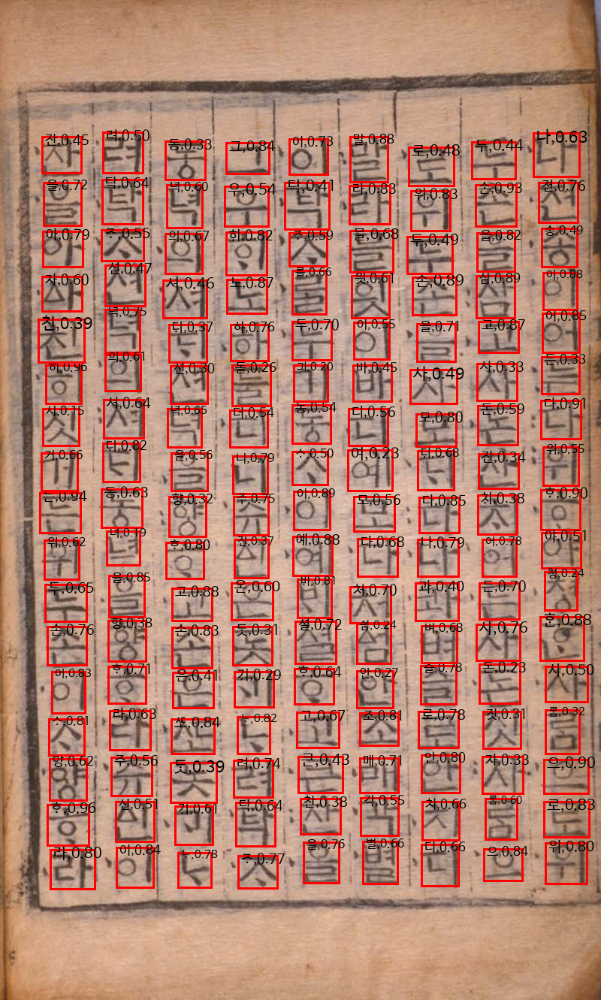
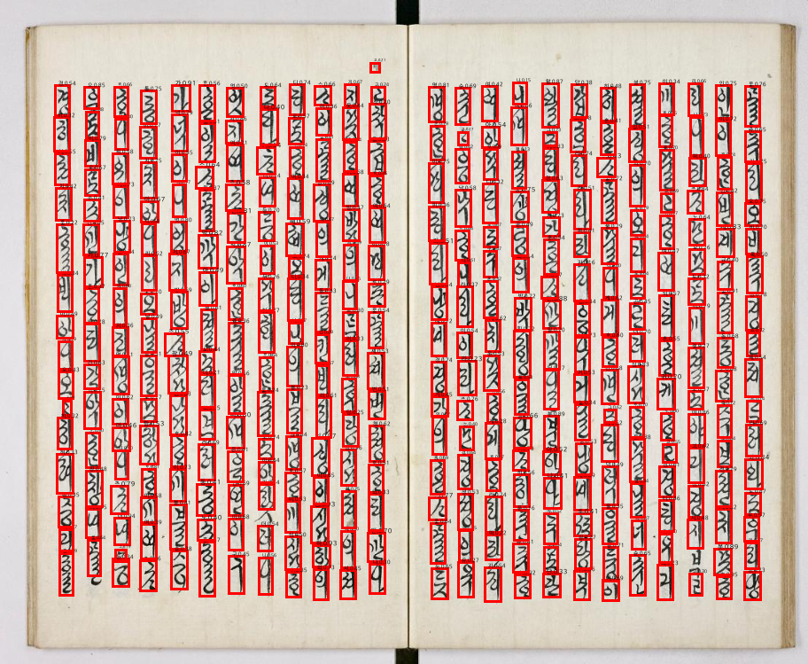

# Historical_Document(Chinese,YetHangul)_OCR

This code implemented based on SSD<a href=https://github.com/NVIDIA/DeepLearningExamples/tree/c5a2c85efc85864474c8687be3f141074785a42f/PyTorch/Detection/SSD>[link]</a>

And reimplement FAN-MCCD: Fast and Accurate Network for Multi-Scale Chinese Character Detection(2021, [<a href=https://www.ncbi.nlm.nih.gov/pmc/articles/PMC8586960/#sec3dot5-sensors-21-07289>link</a>])

You can get this data <a href=https://aihub.or.kr/aidata/30753>[chinese]</a>,<a href='https://aihub.or.kr/aihubdata/data/view.do?currMenu=115&topMenu=100&aihubDataSe=realm&dataSetSn=504'>[YetHangul]</a> 

YetHangul font from <a href=https://hangeul.naver.com/2014/archaicword>[here]</a>

# Data Architecture
```
Historical Chinese
|ㅡㅡ train
|      |ㅡㅡ Haeseo
|      |       |ㅡㅡ train_img1.jpg
|      |       |ㅡㅡ train_img1.json
|      |       |ㅡㅡ ...
|      |ㅡㅡ Haengseo
|      |       |ㅡㅡ train_img1.jpg
|      |       |ㅡㅡ train_img1.json
|      |       |ㅡㅡ ...
|      |ㅡㅡ ...
|ㅡㅡ valid
|      |ㅡㅡ Haeseo
|      |       |ㅡㅡ valid_img1.jpg
|      |       |ㅡㅡ valid_img1.json
|      |       |ㅡㅡ ...
|      |ㅡㅡ Haengseo
|      |       |ㅡㅡ valid_img1.jpg
|      |       |ㅡㅡ valid_img1.json
|      |       |ㅡㅡ ...
|      |ㅡㅡ ...
|ㅡㅡ test
|      |ㅡㅡ Haeseo
|      |       |ㅡㅡ test_img1.jpg
|      |       |ㅡㅡ test_img1.json
|      |       |ㅡㅡ ...
|      |ㅡㅡ Haengseo
|      |       |ㅡㅡ test_img1.jpg
|      |       |ㅡㅡ test_img1.json
|      |       |ㅡㅡ ...
|      |ㅡㅡ ...

Yethangul
|ㅡㅡ 이미지데이터
|         | ㅡㅡ 필사본
|         |        |ㅡㅡ img.png
|         |        |ㅡㅡ ...
|         | ㅡㅡ ...
|ㅡㅡ 라벨링데이터
|         | ㅡㅡ 필사본
|         |        |ㅡㅡ img.json
|         |        |ㅡㅡ ...
|         | ㅡㅡ ...
```

# Data Statistics

Data Splitted 8:1:1

<div align='center'>
  
|style|Train|Valid|Test|
|---|---|---|---|
|해서|29044|3630|3631|
|행서|12962|1620|1621|
|예서|141|18|18|
|초서|1608|201|202|
|전서|728|91|91|

Historical Chinese Dataset
</div>

# Model Architecture

Backbone : Resnet50(Pretrained)

<p align='center'>
  
</p>
<p align='center'>
  <em>Architecture(FAN-MCCD)</em>
</p>

Input Image Size : (3,512,512), RGB

I added maxpooling2d after feature extract layers to adjust output size(8x8, 16x16, 32x32, 64x64) before inputted in upconvolution

# Train and Test
```
train           : python main.py --data_dir [your data folder path] --type [chinese or yethangul]
test            : python main.py --data_dir [your data folder path] --type [chinese or yethangul] --weight_fn [your weight filename] --test 
test only image : python test.py --data_dir [your image folder path] --weight_fn [your weight filename]
```

# Result


<p align='center'>
  
  
</p>

<div align="center">

|style|backbone|AP<sub>25</sub>|AP<sub>50</sub>|AP<sub>75</sub>|
|---|---|---|---|---|
|해서|Resnet50|0.41|0.41|0.40|
|행서|Resnet50|0.41|0.41|0.40|
|예서|Resnet50|0.44|0.44|0.39|
|초서|Resnet50|0.24|0.24|0.22|
|전서|Resnet50|0.07|0.07|0.06|

Historical Chinese Dataset Result

</div>
  
<p align='center'>
  
  
</p>
  
<div align="center">
  
|style|backbone|AP<sub>25</sub>|AP<sub>50</sub>|AP<sub>75</sub>|
|---|---|---|---|---|
|yethangul|Resnet50|0.24|0.24|0.22|

Historical Yethangul Dataset Result

</div>

# Comment

I think calculate mAP is not correct 100%, I calculate precision and recall according to change confidence per class.

If you have any advice, please remain comment.

Thank you.

# TODO List
 
1. Add learning scheduler   
2. Code optimization   
